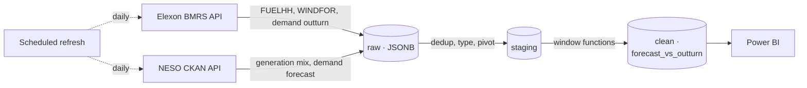

# UK Grid Observatory

When National Grid ESO (NESO) and Elexon publish forecasts for UK
electricity generation -- especially wind -- how much does that forecast
actually diverge from what gets metered and settled after the fact?
Reported ≠ real, and the gap between them is where operational risk
(balancing costs, price spikes, grid stress) actually lives.

This project is a small but complete data pipeline that answers that
question with real data: it ingests outturn and forecast generation from
two independent public UK energy data sources, lands them in Postgres
through a raw -> staging -> clean warehouse, computes forecast-vs-outturn
divergence with SQL window functions, and visualizes the result.

## Status

The pipeline runs end-to-end against real data: ingestion, raw, staging,
clean (window functions), and a scheduled refresh are all built and
verified. The dashboard (Power BI) has data exported and exact build
steps written, but the `.pbix` itself needs Power BI Desktop, which
can't run in the Linux environment this was built in. See
[`REPO_COMPLETION.md`](REPO_COMPLETION.md) for the phase-by-phase detail
and [`docs/build-log/`](docs/build-log/) for a dated log of decisions
made and gotchas discovered along the way.

## Architecture



- **raw** -- exactly what each API returned, one row per record, full
  payload kept as JSONB for audit. Immutable once written.
- **staging** -- typed, deduplicated to one row per (date, period, fuel
  type, source), so Elexon and NESO can be compared side by side.
- **clean** -- `forecast_vs_outturn`: divergence, rolling averages, and
  ranked worst misses, computed via SQL window functions.

## Data sources

| Source | What | Endpoint |
|---|---|---|
| Elexon BMRS | FUELHH (half-hourly outturn generation by fuel) | `/datasets/FUELHH` |
| Elexon BMRS | WINDFOR (rolling wind generation forecast) | `/datasets/WINDFOR` |
| Elexon BMRS | INDO/ITSDO (half-hourly demand outturn) | `/demand/outturn` |
| NESO | Historic GB Generation Mix (independent outturn cross-check) | CKAN datastore, resource `f93d1835-...` |
| NESO | Historic Day Ahead Demand Forecast | CKAN datastore, resource `9847e7bb-...` |

Sample data already pulled from these live APIs is committed under
[`data/raw/`](data/raw/) -- see that folder's README for row counts and an
important caveat about WINDFOR (it has no historical archive; see
"Gotchas" below).

## Setup

```bash
cp .env.example .env          # edit if you change ports/credentials
docker compose up -d          # starts Postgres 16 on localhost:5432
pip install -r requirements.txt

psql "$DATABASE_URL" -f sql/raw/001_create_raw_tables.sql
psql "$DATABASE_URL" -f sql/staging/001_create_staging_tables.sql
```

Then pull fresh data (optional -- `data/raw/` already has a 90-day sample):

```bash
python3 ingestion/elexon_ingest.py --days 90
python3 ingestion/neso_ingest.py --days 90
python3 ingestion/load_raw.py
python3 ingestion/transform_staging.py
```

Then keep it current with a daily scheduled refresh (see
[`docs/refresh_schedule.md`](docs/refresh_schedule.md) for cron / GitHub
Actions / Task Scheduler options):

```bash
python3 ingestion/refresh.py
```

This matters more than it sounds: WINDFOR has no historical archive (see
Gotchas below), so real forecast-vs-outturn history only exists for
whatever days this has actually been run on.

## Gotchas discovered while building this

- **Elexon FUELHH** rejects any single request spanning more than 7 days.
- **Elexon `/demand/outturn`** rejects more than 28 days in one request --
  a different limit than FUELHH, on a different endpoint. The generic
  `/datasets/INDO` endpoint looks like it should behave like FUELHH but
  silently ignores date-range params and always returns just the latest
  settlement period; `/demand/outturn` is the endpoint that actually
  respects a date range for demand history.
- **Elexon WINDFOR is a rolling forecast only.** Querying it with a past
  `settlementDateFrom`/`To` does not return historical forecasts -- it
  returns whatever the *current* forecast horizon is. There is no
  historical WINDFOR archive. The only way to build up real forecast
  history is to snapshot WINDFOR repeatedly over time via a scheduled job.
- **NESO SQL column quoting:** column names in a `datastore_search_sql`
  query must be double-quoted (`"DATETIME"`, not `DATETIME`), or Postgres
  lower-cases them and the query fails with
  `column "datetime" does not exist`.
- **NESO `&format=csv`** is ignored on the `datastore_search_sql` action --
  it always returns JSON. Only the plain `datastore_search` action
  respects `format=csv`.
- **NESO rate limit:** roughly 2 requests/minute; the ingestion script
  sleeps between calls accordingly.

Full detail on how each of these was found is in
[`docs/build-log/`](docs/build-log/).

## Results so far

Two different things were measured, with very different sample sizes --
worth being explicit about which is which rather than blending them into
one confident-sounding headline.

**Elexon vs NESO wind outturn agreement (real, n = 4,320 half-hour
periods over 90 days):** the two independent measurements of actual wind
generation agree closely -- correlation **0.985**, mean absolute
difference **380.5 MW** (against wind generation typically in the
5,000–15,000 MW range over this window). This is a solid result: two
separately-operated data pipelines measuring the same physical thing land
within a few percent of each other almost all the time.

**WINDFOR forecast vs outturn divergence (preliminary, n = 6 half-hour
periods on one evening):** WINDFOR over-forecast wind generation by a
mean of **2,746 MW** (about **22% of the forecast value**) across the
only 6 settlement periods where a forecast and its matching outturn both
currently exist. **This is not enough data to generalize from** -- see
`docs/build-log/phase-3-clean-layer.md` for exactly why (WINDFOR has no
historical archive; real forecast history only accumulates via the
scheduled refresh running over actual elapsed days/weeks). Treat this
number as "the pipeline works and produced a real, correctly-computed
result," not as "wind forecasts are off by 22% in general" -- that claim
needs the scheduled refresh to run for a meaningful stretch of real time
before it can honestly be made. This README will be updated with that
number once there's enough history to support it.

## Repository layout

```
ingestion/              Ingestion, loading, transform, and scheduled-refresh scripts
sql/raw/                Raw-layer schema migrations
sql/staging/            Staging-layer schema migrations
sql/clean/              Clean/mart-layer schema + window-function views (Phase 3)
data/raw/               Sample data already pulled from the live APIs
dashboard/              Power BI build guide + data exports (Phase 4)
docs/refresh_schedule.md  How and why the scheduled refresh runs
docs/build-log/         Dated, per-phase notes on decisions and gotchas
.github/workflows/      Optional GitHub Action for the scheduled refresh
```
